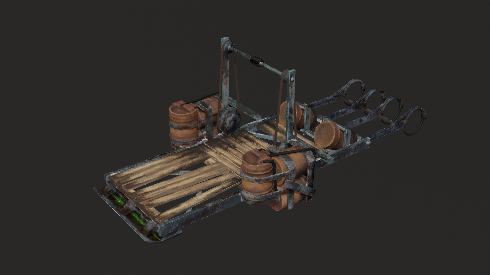
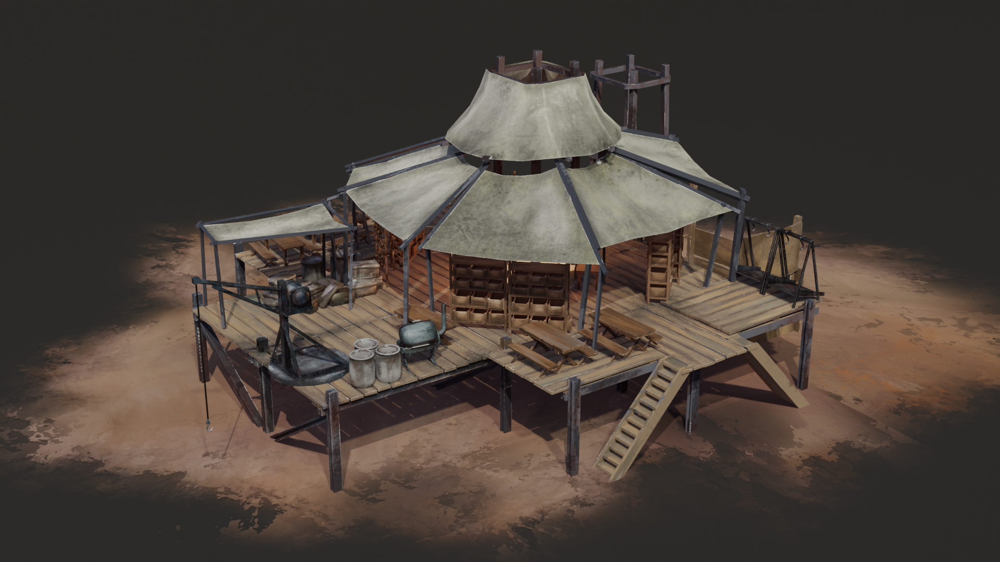
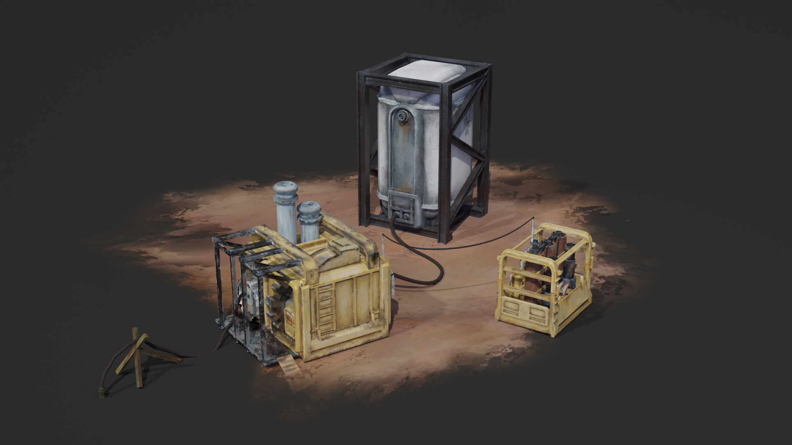
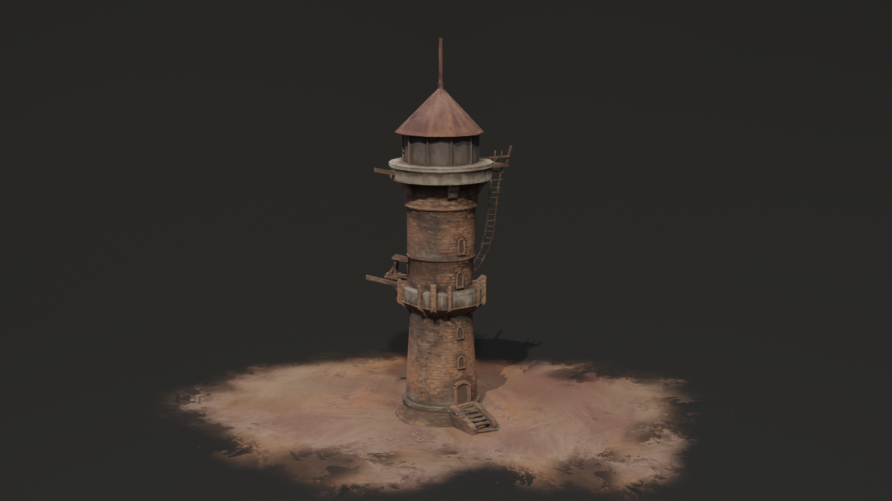
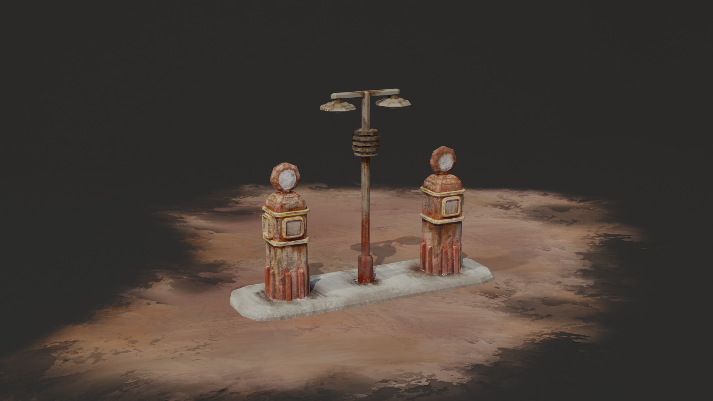
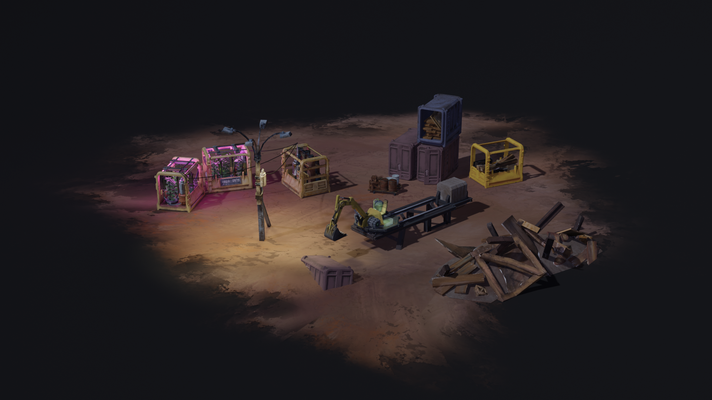
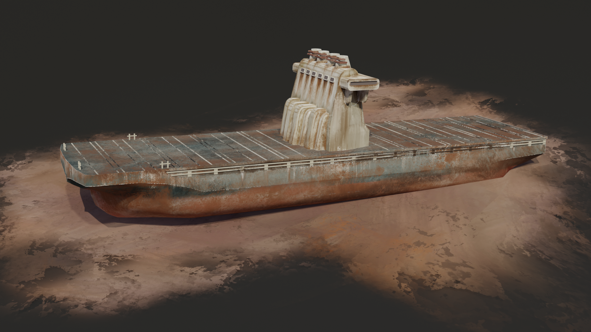
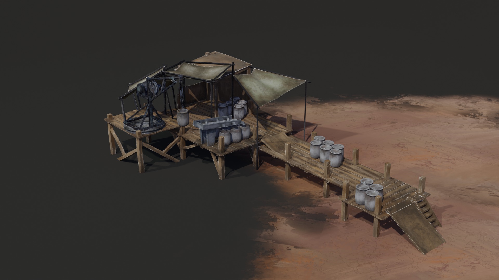

<!DOCTYPE html>
<html>
<head>
    <title>Мое второе портфолио</title>
    <!-- Важно: эта строчка заставляет сайт правильно сжиматься на телефонах -->
    <meta name="viewport" content="width=device-width, initial-scale=1.0">
    
</head>
<body>

    <h1>Привет! Это мой новый сайт</h1>
    
Здесь будет мое второе портфолио.

    <h2>Мои работы</h2>

    <!-- Галерея с картинками -->
    

        
        
        
        
        
        
        
        
    

   

    <!-- Модальное окно для просмотра в полный размер -->
    

        &times;
        
    

    <!-- Скрипт для открытия картинок в полный размер -->
    

</body>
</html>
